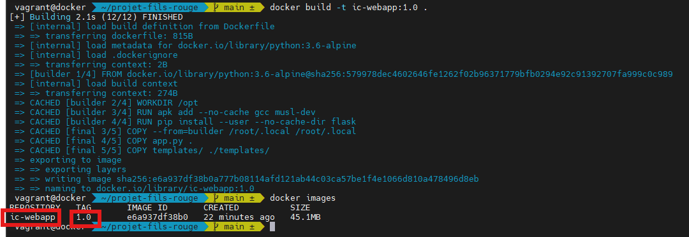
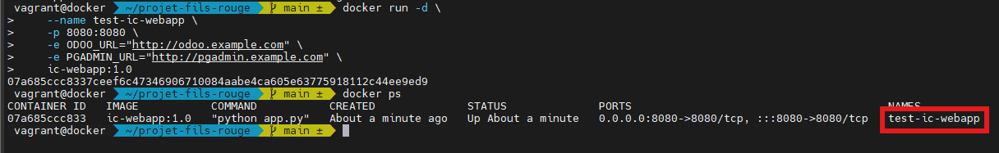
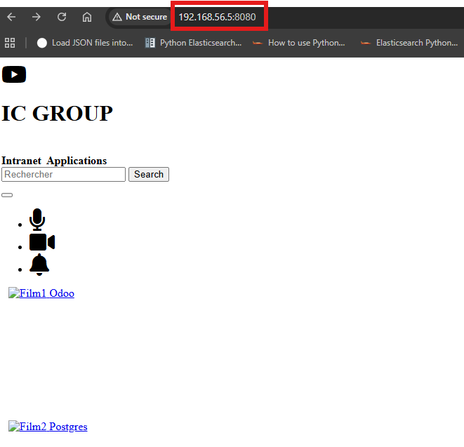
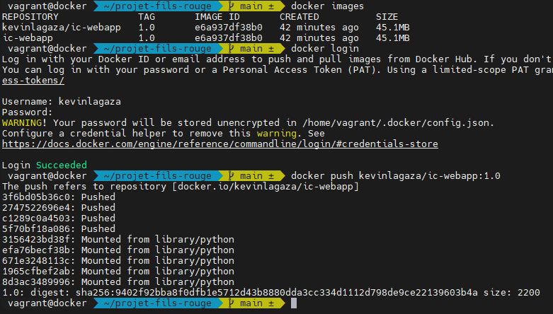
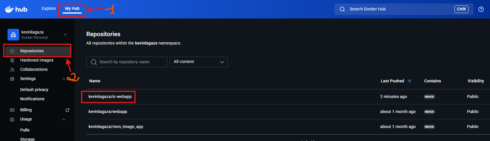
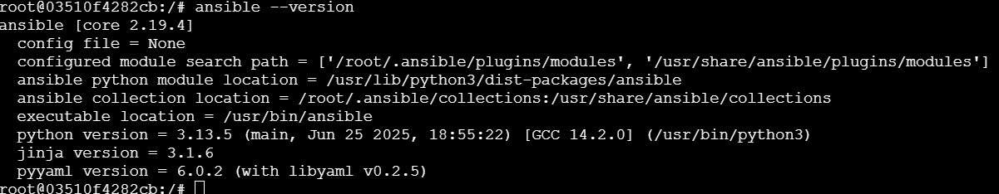

# COMPLETE DEVOPS PROJECT 

## **Context**

The company **IC GROUP**, where I work as a DevOps engineer, wants to set up a showcase website that provides access to its 2 flagship applications:

1) Odoo
2) pgAdmin

**Odoo** is a multi-purpose ERP that manages sales, purchases, accounting, inventory, personnel, and more.
Odoo is distributed in both Community and Enterprise editions. ICGROUP wants to have control over the code and make its own modifications and customizations, so they opted for the Community edition. Several versions of Odoo are available, and version 13.0 was chosen because it includes an LMS (Learning Management System) that will be used to publish internal training courses and share information more easily.
Useful links:

- Official website: [ https://www.odoo.com/ ](https://www.odoo.com/) 
- Official GitHub: [ https://github.com/odoo/odoo.git ](https://github.com/odoo/odoo.git)
- Official Docker Hub: [ https://hub.docker.com/_/odoo ](https://hub.docker.com/_/odoo)

**pgAdmin** will be used to graphically administer the PostgreSQL database created previously.

- Official website: [ https://www.pgadmin.org/ ](https://www.pgadmin.org/) 
- Official Docker Hub: [ https://hub.docker.com/r/dpage/pgadmin4/ ](https://hub.docker.com/r/dpage/pgadmin4/)

## **Part 1: Contenerization of the web app** 

The showcase website was designed by the company's development team. It is my responsibility to containerize this application while allowing the input of the different application URLs (Odoo and pgAdmin) through environment variables.

1) **Build and test**

- docker build -t ic-webapp:1.0 .
- docker images
- docker run -d \
    --name test-ic-webapp \
    -p 8080:8080 \
    -e ODOO_URL="http://odoo.example.com" \
    -e PGADMIN_URL="http://pgadmin.example.com" \
    ic-webapp:1.0
- docker ps

****

****

****

2) **Push image to Docker Hub**
- docker rm -f test-ic-webapp
- docker tag ic-webapp:1.0 kevinlagaza/ic-webapp:1.0
- docker login (enter username and password)
- docker push kevinlagaza/ic-webapp:1.0 

****

****

## **Part 2 : CI/CD pipeline with JENKINS and ANSIBLE** 
ICGROUP's objective is to set up a CI/CD pipeline enabling continuous integration and deployment of this solution across their different machines in the production environment (3 servers hosted in AWS cloud).

#### Prerequisites

1) AWS

- Create an **elastic IP**. 
- Create a **security group** and attach **SSH, HTTP, HTTPS, 8080, 8069 and 50000** in the security group rules.
- Create one server (**with at least 30 GB of storage**) and attach both previous elastic IP and security group. 
- Create **two other servers** for both **odoo** and **webapp**.  
- Install **docker** and **docker-compose** on all servers

Recall that all the servers should have at least 20 GB of storage to avoid storage.

```bash
# Docker
curl -fsSL https://get.docker.com -o get-docker.sh
sh get-docker.sh
sudo usermod -aG docker ubuntu
sudo systemctl start docker
sudo systemctl enable docker
docker --version

# Docker-Compose
sudo curl -L "https://github.com/docker/compose/releases/download/1.29.2/docker-compose-$(uname -s)-$(uname -m)" -o /usr/local/bin/docker-compose
sudo chmod +x /usr/local/bin/docker-compose
docker-compose -v
```

2) Install tools (on the first server)

a) **Jenkins**

**Step 1:**

```bash
# Create directory for Jenkins data
mkdir -p ~/jenkins_home
# Run the Jenkins container
docker run -d \
  --name jenkins \
  --restart=unless-stopped \
  -p 8080:8080 \
  -p 50000:50000 \
  -v jenkins_home:/var/jenkins_home \
  -v /var/run/docker.sock:/var/run/docker.sock \
  -v /usr/bin/docker:/usr/bin/docker \
  jenkins/jenkins:lts

# Enter the Jenkins container
docker exec -it -u root jenkins bash

# Add Jenkins to Docker group
groupadd -f docker
usermod -aG docker jenkins
chmod 666 /var/run/docker.sock

# Exit and restart the Jenkins container
exit
docker restart jenkins

# Retrieve the initial admin password
docker exec jenkins cat /var/jenkins_home/secrets/initialAdminPassword
```
Then access the Jenkins web UI by typing **ELASTIC_IP:8080** in the browser.

**Step2:** Install the following plugins

- SSH Agent
- Ansible
- Docker Pipeline
- Slack Notification
- SonarQube Scanner

**Step3:** Add the following credentials

- **Global Scope Credentials:** sonar-project-key, dockerhub-credentials, sonarcloud-token, slack-token
- **Jenkins Scope Credentials:** prod-server-ssh

b) **Ansible**

```bash
# Enter the Jenkins container
docker exec -it -u root jenkins bash

# Install Ansible
apt-get update && apt-get install -y --no-install-recommends \
    ansible \
    sshpass \
    && rm -rf /var/lib/apt/lists/*

# Verify the installation
ansible --version

# Get out of the container
exit
```
****

2) Install odoo (on the second server)

Recall to add a security group rule for port 8069.
```bash
# Start a PostgreSQL server
docker run -d -e POSTGRES_USER=odoo -e POSTGRES_PASSWORD=odoo -e POSTGRES_DB=postgres --name db postgres:15
# Start an Odoo instance
docker run -p 8069:8069 --name odoo --link db:db -t odoo:13
# Verify the containers
docker ps
docker inspect --format='{{json .State.Health}}' odoo | jq
```
Then type ``http://<EC2_PUBLIC_IP>:8069`` in the web browser.