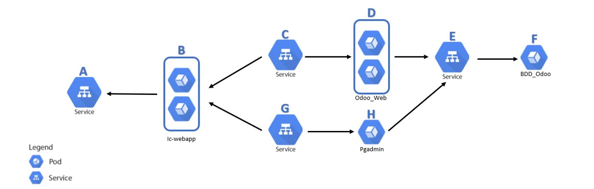
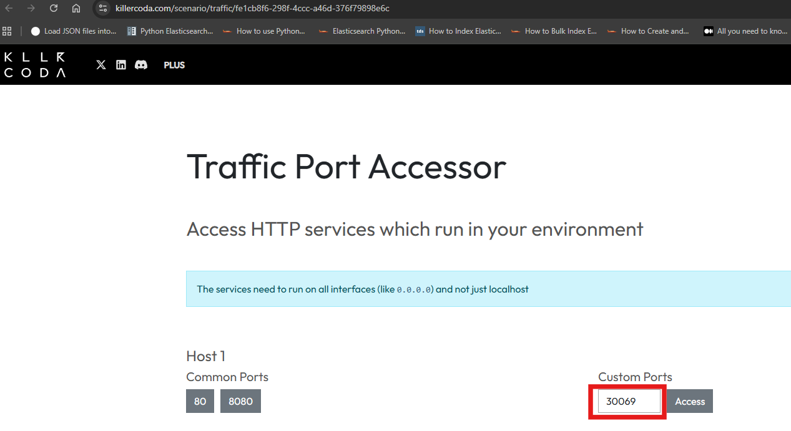
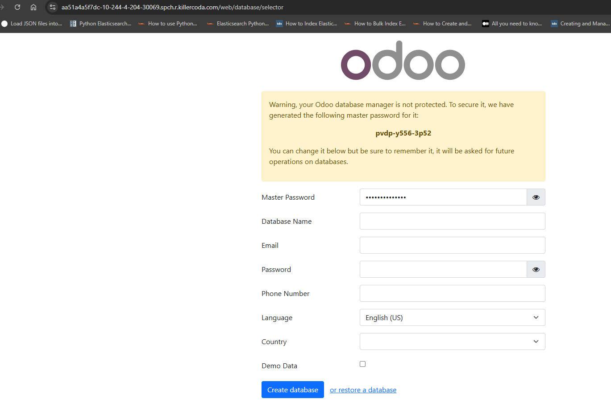
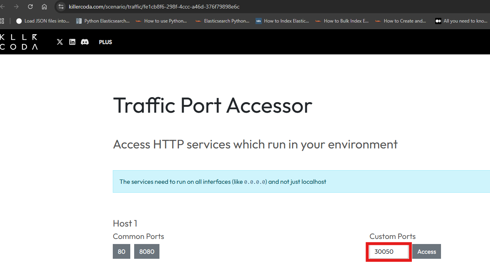
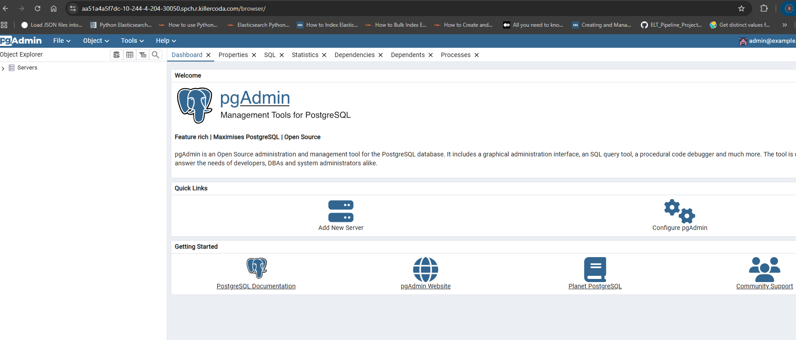

# 🚀 IC GROUP - Complete DevOps Project

[](https://kubernetes.io/)
[](https://www.docker.com/)
[](https://www.jenkins.io/)
[](https://www.ansible.com/)
[](https://aws.amazon.com/)

---

## 📋 Table of Contents

- [Project Overview](#-project-overview)
- [Architecture](#-architecture)
- [Technologies Used](#-technologies-used)
- [Part 1: Containerization](#-part-1-containerization)
- [Part 2: CI/CD Pipeline](#-part-2-cicd-pipeline)
- [Part 3: Kubernetes Deployment](#-part-3-kubernetes-deployment)
- [Key Achievements](#-key-achievements)
- [Lessons Learned](#-lessons-learned)
- [Future Improvements](#-future-improvements)
- [Author](#-author)

---

## 🎯 Project Overview

### Context

As a **DevOps Engineer** at **IC GROUP**, I was tasked with designing and implementing a complete CI/CD infrastructure for deploying a showcase website that provides access to two flagship enterprise applications.

### Business Objectives

| Objective | Solution |
|-----------|----------|
| Centralized access to enterprise apps | Custom web portal (ic-webapp) |
| ERP for business operations | Odoo 13.0 Community Edition |
| Database administration | pgAdmin 4 |
| Automated deployments | Jenkins + Ansible |
| Container orchestration | Kubernetes |

### Applications

| Application | Description | Why Chosen |
|-------------|-------------|------------|
| **Odoo 13.0** | Multi-purpose ERP (sales, purchases, accounting, inventory, HR) | Community edition for code control + Built-in LMS |
| **pgAdmin 4** | PostgreSQL graphical administration tool | Industry standard for database management |
| **ic-webapp** | Custom showcase website | Centralized access point for all applications |

---

## 🏗 Architecture

### Kubernetes Architecture



| Component | Description | Replicas |
|-----------|-------------|----------|
| **A** | Service exposing ic-webapp | - |
| **B** | ic-webapp pods | 2 |
| **C** | Service exposing Odoo | - |
| **D** | Odoo pods | 2 |
| **E** | Service exposing PostgreSQL | - |
| **F** | PostgreSQL pod | 1 |
| **G** | Service exposing pgAdmin | - |
| **H** | pgAdmin pod | 1 |

---

## 🛠 Technologies Used

### DevOps Tools

| Category | Technology | Purpose |
|----------|------------|---------|
| **Containerization** | Docker | Application packaging |
| **Orchestration** | Kubernetes | Container management |
| **CI/CD** | Jenkins | Pipeline automation |
| **Configuration Management** | Ansible | Infrastructure provisioning |
| **Cloud** | AWS EC2 | Server hosting |
| **Code Quality** | SonarQube | Static code analysis |
| **Registry** | Docker Hub | Image storage |
| **Version Control** | GitHub | Source code management |

### Security & Networking

| Port | Service | Protocol |
|------|---------|----------|
| 22 | SSH | TCP |
| 80 | HTTP | TCP |
| 443 | HTTPS | TCP |
| 8080 | Jenkins | TCP |
| 8069 | Odoo | TCP |
| 5050 | pgAdmin | TCP |
| 50000 | Jenkins Agent | TCP |

---

## 🐳 Part 1: Containerization

### 1.1 Dockerfile Strategy

The ic-webapp was containerized with environment variable support for dynamic configuration:

```bash
# Build the image
docker build -t ic-webapp:1.0 .

# Run with environment variables
docker run -d \
    --name test-ic-webapp \
    -p 8080:8080 \
    -e ODOO_URL="http://odoo.example.com" \
    -e PGADMIN_URL="http://pgadmin.example.com" \
    ic-webapp:1.0
```

### 1.2 Build & Test Results

| Step | Screenshot |
|------|------------|
| Docker Build |  |
| Docker Run |  |
| Application Test |  |

### 1.3 Push to Registry

```bash
# Tag and push
docker tag ic-webapp:1.0 kevinlagaza/ic-webapp:1.0
docker push kevinlagaza/ic-webapp:1.0
```

| Step | Screenshot |
|------|------------|
| Pushing to DockerHub |  |
| DockerHub Repository |  |

---

## 🔄 Part 2: CI/CD Pipeline

### 2.1 AWS Infrastructure Setup

#### Prerequisites

| Requirement | Specification |
|-------------|---------------|
| Jenkins Server | 30 GB storage minimum |
| Application Servers | 20 GB storage minimum (x2) |
| Elastic IP | 1 per server |
| Security Group | Ports: 22, 80, 443, 8080, 5050, 8069, 50000 |


#### Docker Installation (All Servers)

```bash
# Install Docker
curl -fsSL https://get.docker.com -o get-docker.sh
sh get-docker.sh
sudo usermod -aG docker ubuntu
sudo systemctl start docker
sudo systemctl enable docker

# Install Docker Compose
sudo curl -L "https://github.com/docker/compose/releases/download/1.29.2/docker-compose-$(uname -s)-$(uname -m)" -o /usr/local/bin/docker-compose
sudo chmod +x /usr/local/bin/docker-compose
```

### 2.2 Jenkins Installation

```bash
# Create Jenkins data directory
mkdir -p ~/jenkins_home

# Run Jenkins container
docker run -d \
  --name jenkins \
  --restart=unless-stopped \
  -p 8080:8080 \
  -p 50000:50000 \
  -v jenkins_home:/var/jenkins_home \
  -v /var/run/docker.sock:/var/run/docker.sock \
  -v /usr/bin/docker:/usr/bin/docker \
  jenkins/jenkins:lts

# Configure Docker permissions
docker exec -it -u root jenkins bash
groupadd -f docker
usermod -aG docker jenkins
chmod 666 /var/run/docker.sock
exit
docker restart jenkins

# Get initial admin password
docker exec jenkins cat /var/jenkins_home/secrets/initialAdminPassword
```

> 💡 Access Jenkins at `http://<ELASTIC_IP>:8080`

### 2.3 Ansible Installation

```bash
docker exec -it -u root jenkins bash
apt-get update && apt-get install -y --no-install-recommends \
    ansible \
    sshpass \
    && rm -rf /var/lib/apt/lists/*
ansible --version
exit
```


### 2.4 Jenkins Configuration

#### Required Plugins

| Plugin | Purpose |
|--------|---------|
| SSH Agent | Remote server connections |
| Ansible | Playbook execution |
| Docker Pipeline | Docker integration |
| Slack Notification | Build notifications |
| SonarQube Scanner | Code quality analysis |

#### Credentials Setup

| Scope | Credential ID | Type |
|-------|---------------|------|
| Global | dockerhub-credentials | Username/Password |
| Global | sonarcloud-token | Secret text |
| Global | slack-token | Secret text |
| Jenkins | prod-server-ssh | SSH Key |

### 2.5 Odoo Installation (Second Server)

```bash
# Start PostgreSQL
docker run -d \
  -e POSTGRES_USER=odoo \
  -e POSTGRES_PASSWORD=odoo \
  -e POSTGRES_DB=postgres \
  --name db \
  postgres:15

# Start Odoo
docker run -p 8069:8069 --name odoo --link db:db -t odoo:13

# Verify
docker ps
```

> 💡 Access Odoo at `http://<EC2_PUBLIC_IP>:8069`

### 2.6 Pipeline Execution Results

#### Manual Deployment

| Component | Screenshot |
|-----------|------------|
| Pipeline Execution |  |
| DockerHub v1.0 |  |
| Odoo Deployment |  |
| pgAdmin Deployment |  |
| Web App Deployment |  |

### 2.7 Automated Deployment (GitOps)

#### GitHub Webhook Configuration

**Step 1: Configure Jenkins**
1. Manage Jenkins → Configure System
2. GitHub section → Add GitHub Server
3. Add GitHub credentials

**Step 2: Configure GitHub Repository**
1. Settings → Webhooks → Add webhook
2. Payload URL: `http://<JENKINS_URL>/github-webhook/`
3. Content type: `application/json`
4. Events: Push events only

| Configuration | Result |
|---------------|--------|
|  |  |

---

## ☸️ Part 3: Kubernetes Deployment

> 💡 **Environment:** [KillerCoda](https://killercoda.com/) Kubernetes playground

### 3.1 Prerequisites

| Requirement | Version |
|-------------|---------|
| Kubernetes | 1.19+ |
| kubectl | Latest |
| Docker | Latest |
| Docker Hub Account | Required |

```bash
# Create namespace
kubectl apply -f k8s/namespace.yml

# Create secrets and configMaps
kubectl apply -f k8s/secrets/
kubectl apply -f k8s/configMap/

# Create persistent volumes
kubectl apply -f k8s/volumes/
```


### 3.2 Ingress & Load Balancer Setup

```bash
# Install NGINX Ingress Controller
kubectl apply -f https://raw.githubusercontent.com/kubernetes/ingress-nginx/controller-v1.10.0/deploy/static/provider/cloud/deploy.yaml

# Verify installation
kubectl get pods -n ingress-nginx
kubectl get svc -n ingress-nginx

# Install MetalLB for bare-metal load balancing
kubectl apply -f https://raw.githubusercontent.com/metallb/metallb/v0.14.5/config/manifests/metallb-native.yaml

# Wait for MetalLB pods
kubectl wait --namespace metallb-system \
  --for=condition=ready pod \
  --selector=app=metallb \
  --timeout=90s

# Apply MetalLB and Ingress configuration
kubectl apply -f loadbalancer/metallb-config.yml
kubectl apply -f k8s/ingress/ingress.yml
```

### 3.3 Application Deployments

#### PostgreSQL & Odoo

```bash
kubectl apply -f k8s/deployments/postgres-deployment.yml
kubectl apply -f k8s/services/postgres-service.yml
kubectl apply -f k8s/deployments/odoo-deployment.yml
kubectl apply -f k8s/services/odoo-service.yml

# Scale to 2 replicas
kubectl scale deployment odoo -n icgroup --replicas=2

# Verify
kubectl get pods -n icgroup -l app=odoo
kubectl logs -n icgroup -l app=odoo

# Access (KillerCoda)
kubectl port-forward svc/odoo-service 30069:8069 -n icgroup --address 0.0.0.0
```

| Deployment Status | Traffic Port Access | Odoo Interface |
|-------------------|---------------------|----------------|
|  |  |  |

#### pgAdmin

```bash
kubectl apply -f k8s/deployments/pgadmin-deployment.yml
kubectl apply -f k8s/services/pgadmin-service.yml

# Verify
kubectl get pods -n icgroup -l app=pgadmin
kubectl logs -n icgroup -l app=pgadmin

# Access (KillerCoda)
kubectl port-forward svc/pgadmin-service 30050:80 -n icgroup --address 0.0.0.0
```

| Deployment Status | Traffic Port Access | pgAdmin Interface |
|-------------------|---------------------|-------------------|
|  |  |  |

#### ic-webapp

```bash
kubectl apply -f k8s/deployments/ic-webapp-deployment.yml
kubectl apply -f k8s/services/ic-webapp-service.yml

# Verify
kubectl get pods -n icgroup -l app=ic-webapp
kubectl logs -n icgroup -l app=ic-webapp

# Access (KillerCoda)
kubectl port-forward svc/ic-webapp-service 30080:8080 -n icgroup --address 0.0.0.0
```

| Deployment Status | Traffic Port Access | ic-webapp Interface |
|-------------------|---------------------|---------------------|
|  |  |  |

### 3.4 One-Command Deployment

Deploy all applications at once using **Kustomize**:

```bash
kubectl apply -k k8s/
```

### 3.5 Access Summary

| Application | Local Domain | NodePort | Port-Forward Command |
|-------------|--------------|----------|----------------------|
| ic-webapp | ic-webapp.local | 30080 | `kubectl port-forward svc/ic-webapp-service 30080:8080 -n icgroup --address 0.0.0.0` |
| Odoo | odoo.local | 30069 | `kubectl port-forward svc/odoo-service 30069:8069 -n icgroup --address 0.0.0.0` |
| pgAdmin | pgadmin.local | 30050 | `kubectl port-forward svc/pgadmin-service 30050:80 -n icgroup --address 0.0.0.0` |

---

## 🏆 Key Achievements

| Achievement | Impact |
|-------------|--------|
| ✅ Reduced deployment time | From hours to minutes with CI/CD |
| ✅ Zero-downtime deployments | Rolling updates with Kubernetes |
| ✅ Infrastructure as Code | Reproducible environments |
| ✅ Automated testing | SonarQube integration for code quality |
| ✅ Scalable architecture | Easy horizontal scaling with replicas |
| ✅ GitOps workflow | Automatic deployments on push |

---

## 📚 Lessons Learned

| Challenge | Solution |
|-----------|----------|
| Docker socket permissions in Jenkins | Mount socket + configure group permissions |
| Kubernetes probe configuration | Use startupProbe for slow-starting apps |
| ConfigMap file permissions | Use initContainers for permission fixes |
| MetalLB on bare-metal | Configure IP address pools correctly |
| Service discovery | Use Kubernetes DNS (service-name.namespace) |

---

## 🔮 Future Improvements

- [ ] Implement Helm charts for easier deployment management
- [ ] Add Prometheus + Grafana for monitoring
- [ ] Implement GitOps with ArgoCD
- [ ] Add SSL/TLS with cert-manager
- [ ] Implement horizontal pod autoscaling (HPA)
- [ ] Add backup solution for PostgreSQL data

---

## 🔗 Useful Links

| Resource | URL |
|----------|-----|
| Odoo Official | [https://www.odoo.com/](https://www.odoo.com/) |
| Odoo GitHub | [https://github.com/odoo/odoo.git](https://github.com/odoo/odoo.git) |
| Odoo Docker Hub | [https://hub.docker.com/_/odoo](https://hub.docker.com/_/odoo) |
| pgAdmin Official | [https://www.pgadmin.org/](https://www.pgadmin.org/) |
| pgAdmin Docker Hub | [https://hub.docker.com/r/dpage/pgadmin4/](https://hub.docker.com/r/dpage/pgadmin4/) |

---

## 👨‍💻 Author

**P. Kevin Lagaza**  
DataOps Engineer

[]([www.linkedin.com/in/pirewa-kevin-lagaza](https://www.linkedin.com/in/pirewa-kevin-lagaza/))
[](https://github.com/kevinlagaza)
[](mailto:lagazakevin@gmail.com)

---

## 📄 License

This project is licensed under the MIT License - see the [LICENSE](LICENSE) file for details.

---

<p align="center">
  <i>⭐ If you found this project helpful, please consider giving it a star!</i>
</p>